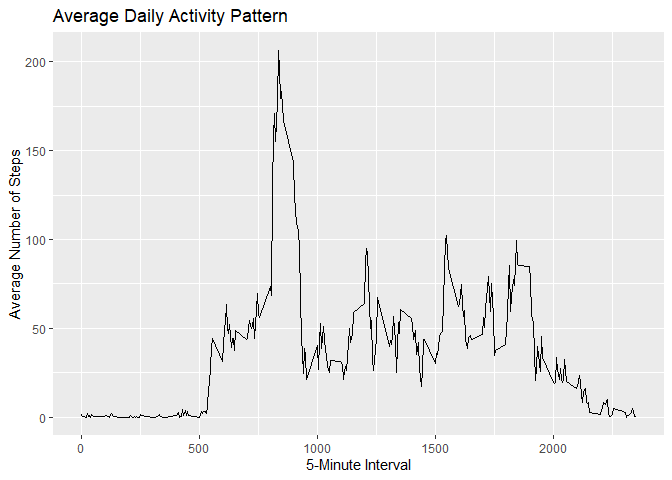

## Loading and preprocessing the data


``` r
knitr::opts_chunk$set(echo = TRUE)

library(tidyverse)
# Extracting file names inside the Zip file
unzip("repdata_data_activity.zip", list = TRUE)$Name

# Unzipping the file
unzip("repdata_data_activity.zip")

# Reading the data set
activities<- read.csv("activity.csv")
activities
```

## What is mean total number of steps taken per day?


``` r
total_step_day<- activities %>%
        group_by(date) %>% 
        summarise(total_step= sum(steps, na.rm= T))

total_step_day
```

```
## # A tibble: 61 × 2
##    date       total_step
##    <chr>           <int>
##  1 2012-10-01          0
##  2 2012-10-02        126
##  3 2012-10-03      11352
##  4 2012-10-04      12116
##  5 2012-10-05      13294
##  6 2012-10-06      15420
##  7 2012-10-07      11015
##  8 2012-10-08          0
##  9 2012-10-09      12811
## 10 2012-10-10       9900
## # ℹ 51 more rows
```


#### **histogram** of the total number of steps taken each day

``` r
hist(total_step_day$total_step)
```

<!-- -->

#### **mean** and **median** total number of steps taken per day

``` r
mean(total_step_day$total_step, na.rm = T)
```

```
## [1] 9354.23
```

``` r
median(total_step_day$total_step, na.rm = T)
```

```
## [1] 10395
```

## What is the average daily activity pattern?


``` r
activity_pattern <- activities %>%
    group_by(interval) %>%
    summarise(mean_steps = mean(steps, na.rm = TRUE))

activity_pattern
```

```
## # A tibble: 288 × 2
##    interval mean_steps
##       <int>      <dbl>
##  1        0     1.72  
##  2        5     0.340 
##  3       10     0.132 
##  4       15     0.151 
##  5       20     0.0755
##  6       25     2.09  
##  7       30     0.528 
##  8       35     0.868 
##  9       40     0     
## 10       45     1.47  
## # ℹ 278 more rows
```

#### **Time series plot** with ggplot2 

``` r
p<- ggplot(activity_pattern, aes(interval, mean_steps))+
        geom_line()+
        labs(title="Average Daily Activity Pattern",
              x= "5-Minute Interval",
              y= "Average Number of Steps")


p
```

<!-- -->


#### The interval with maximum activity

``` r
activity_pattern %>%
    filter(mean_steps == max(mean_steps))
```

```
## # A tibble: 1 × 2
##   interval mean_steps
##      <int>      <dbl>
## 1      835       206.
```


## Imputing missing values

#### Number of missing values in rows

``` r
sum(is.na(activities$steps))
```

```
## [1] 2304
```

#### confirming that the other variables contain no missing observations

``` r
colSums(is.na(activities))
```

```
##    steps     date interval 
##     2304        0        0
```

#### Imputation strategy

#### Devising a strategy for filling in all of the missing values in the dataset.


``` r
# Mean for each 5-minute interval
imputeNA_with_mean<- activities %>% 
        group_by(interval) %>% 
        mutate(steps= if_else(is.na(steps),
                              mean(steps,na.rm= TRUE),
                              steps))
imputeNA_with_mean
```

```
## # A tibble: 17,568 × 3
## # Groups:   interval [288]
##     steps date       interval
##     <dbl> <chr>         <int>
##  1 1.72   2012-10-01        0
##  2 0.340  2012-10-01        5
##  3 0.132  2012-10-01       10
##  4 0.151  2012-10-01       15
##  5 0.0755 2012-10-01       20
##  6 2.09   2012-10-01       25
##  7 0.528  2012-10-01       30
##  8 0.868  2012-10-01       35
##  9 0      2012-10-01       40
## 10 1.47   2012-10-01       45
## # ℹ 17,558 more rows
```

#### Creating new data set with missing values

``` r
# Computing the interval mean
avg_interval <- activities %>%
    group_by(interval) %>%
    summarise(mean_steps = mean(steps, na.rm = TRUE))


# Creating a new data set:
activities_imputed <- activities %>%
    left_join(avg_interval, by = "interval") %>%
    mutate(steps = ifelse(is.na(steps),
                          mean_steps,
                          steps)) %>%
    select(steps, date, interval)

# Checking if there is any missing values 
sum(is.na(activities_imputed$steps))
```

```
## [1] 0
```

#### Daily steps after imputing missing values

``` r
daily_steps_imputed <- activities_imputed %>%
    group_by(date) %>%
    summarise(total_steps = sum(steps))
```


#### Histogram

``` r
hist(daily_steps_imputed$total_steps,
     main = "Total Steps per Day After Imputation",
     xlab = "Total Steps per Day",
     col = "lightblue",
     border = "white")
```

<!-- -->

#### Calculating mean and median

``` r
mean(daily_steps_imputed$total_steps)
```

```
## [1] 10766.19
```

``` r
median(daily_steps_imputed$total_steps)
```

```
## [1] 10766.19
```

## Are there differences in activity patterns between weekdays and weekends?

#### Creating weekday/weekend variable

``` r
activities_imputed$date<- as.Date(activities_imputed$date)

activities_imputed <- activities_imputed %>%
    mutate(day = weekdays(date),
           day_type = ifelse(day %in% c("Saturday", "Sunday"),
                             "weekend",
                             "weekday"),
           day_type = factor(day_type,
                             levels = c("weekday", "weekend")))
activities_imputed

# Checking 
table(activities_imputed$day_type)
```

#### calculating the mean number of steps for each interval and day type

``` r
activity_pattern <- activities_imputed %>%
    group_by(day_type, interval) %>%
    summarise(mean_steps = mean(steps),
              .groups = "drop")
activity_pattern
```

```
## # A tibble: 576 × 3
##    day_type interval mean_steps
##    <fct>       <int>      <dbl>
##  1 weekday         0     2.25  
##  2 weekday         5     0.445 
##  3 weekday        10     0.173 
##  4 weekday        15     0.198 
##  5 weekday        20     0.0990
##  6 weekday        25     1.59  
##  7 weekday        30     0.693 
##  8 weekday        35     1.14  
##  9 weekday        40     0     
## 10 weekday        45     1.80  
## # ℹ 566 more rows
```


#### Plotting with lattice

``` r
library(lattice)

xyplot(mean_steps ~ interval | day_type,
       data = activity_pattern,
       type = "l",
       layout = c(1, 2),
       xlab = "Interval",
       ylab = "Number of Steps",
       main = "Average Activity Pattern: Weekdays vs Weekends")
```

<!-- -->


