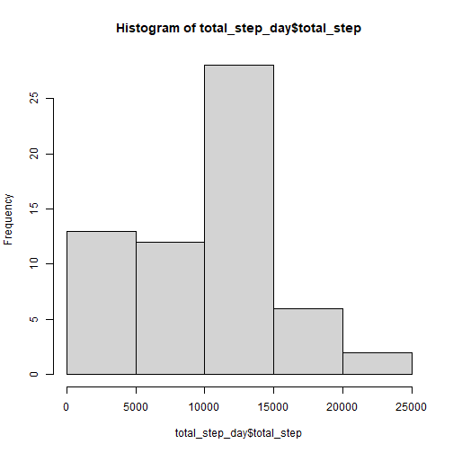
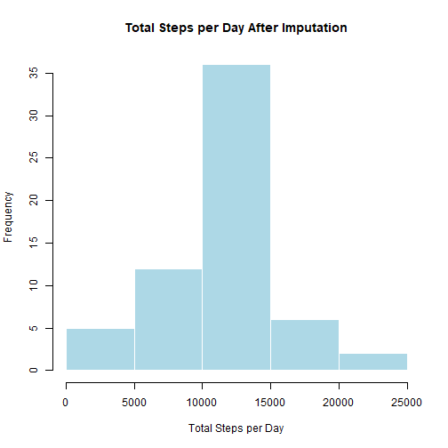
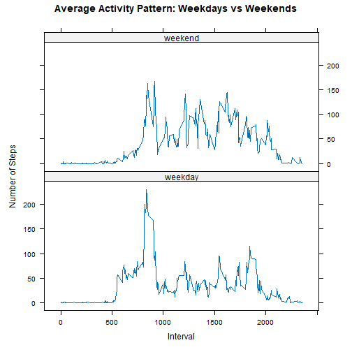

## Loading and preprocessing the data


## What is mean total number of steps taken per day?


``` r
total_step_day<- activities %>%
        group_by(date) %>% 
        summarise(total_step= sum(steps, na.rm= T))

total_step_day
```


#### **histogram** of the total number of steps taken each day

``` r
hist(total_step_day$total_step)
```



#### **mean** and **median** total number of steps taken per day

``` r
mean(total_step_day$total_step, na.rm = T)
```

```
## [1] 9354.23
```

``` r
median(total_step_day$total_step, na.rm = T)
```

```
## [1] 10395
```

## What is the average daily activity pattern?


``` r
activity_pattern <- activities %>%
    group_by(interval) %>%
    summarise(mean_steps = mean(steps, na.rm = TRUE))

activity_pattern
```

#### **Time series plot** with ggplot2 

``` r
p<- ggplot(activity_pattern, aes(interval, mean_steps))+
        geom_line()+
        labs(title="Average Daily Activity Pattern",
              x= "5-Minute Interval",
              y= "Average Number of Steps")
     

library(plotly)
ggplotly(p) %>% 
        layout(
        title = "Average Daily Activity Pattern",
        xaxis = list(title = "5-Minute Interval"),
        yaxis = list(title = "Average Number of Steps")
    )
```

```
## Error in path.expand(path): invalid 'path' argument
```


#### The interval with maximum activity

``` r
activity_pattern %>%
    filter(mean_steps == max(mean_steps))
```


## Imputing missing values

#### Number of missing values in rows

``` r
sum(is.na(activities$steps))
```

```
## [1] 2304
```

#### confirming that the other variables contain no missing observations

``` r
colSums(is.na(activities))
```

```
##    steps     date interval 
##     2304        0        0
```

#### Imputation strategy

#### Devising a strategy for filling in all of the missing values in the dataset.


``` r
# Mean for each 5-minute interval
imputeNA_with_mean<- activities %>% 
        group_by(interval) %>% 
        mutate(steps= if_else(is.na(steps),
                              mean(steps,na.rm= TRUE),
                              steps))
imputeNA_with_mean
```

#### Creating new data set with missing values

``` r
# Computing the interval mean
avg_interval <- activities %>%
    group_by(interval) %>%
    summarise(mean_steps = mean(steps, na.rm = TRUE))


# Creating a new data set:
activities_imputed <- activities %>%
    left_join(avg_interval, by = "interval") %>%
    mutate(steps = ifelse(is.na(steps),
                          mean_steps,
                          steps)) %>%
    select(steps, date, interval)

# Checking if there is any missing values 
sum(is.na(activities_imputed$steps))
```

```
## [1] 0
```

#### Daily steps after imputing missing values

``` r
daily_steps_imputed <- activities_imputed %>%
    group_by(date) %>%
    summarise(total_steps = sum(steps))
```


#### Histogram

``` r
hist(daily_steps_imputed$total_steps,
     main = "Total Steps per Day After Imputation",
     xlab = "Total Steps per Day",
     col = "lightblue",
     border = "white")
```



#### Calculating mean and median

``` r
mean(daily_steps_imputed$total_steps)
```

```
## [1] 10766.19
```

``` r
median(daily_steps_imputed$total_steps)
```

```
## [1] 10766.19
```

## Are there differences in activity patterns between weekdays and weekends?

#### Creating weekday/weekend variable

``` r
activities_imputed$date<- as.Date(activities_imputed$date)

activities_imputed <- activities_imputed %>%
    mutate(day = weekdays(date),
           day_type = ifelse(day %in% c("Saturday", "Sunday"),
                             "weekend",
                             "weekday"),
           day_type = factor(day_type,
                             levels = c("weekday", "weekend")))
activities_imputed

# Checking 
table(activities_imputed$day_type)
```

#### calculating the mean number of steps for each interval and day type

``` r
activity_pattern <- activities_imputed %>%
    group_by(day_type, interval) %>%
    summarise(mean_steps = mean(steps),
              .groups = "drop")
activity_pattern
```


#### Plotting with lattice

``` r
library(lattice)

xyplot(mean_steps ~ interval | day_type,
       data = activity_pattern,
       type = "l",
       layout = c(1, 2),
       xlab = "Interval",
       ylab = "Number of Steps",
       main = "Average Activity Pattern: Weekdays vs Weekends")
```




