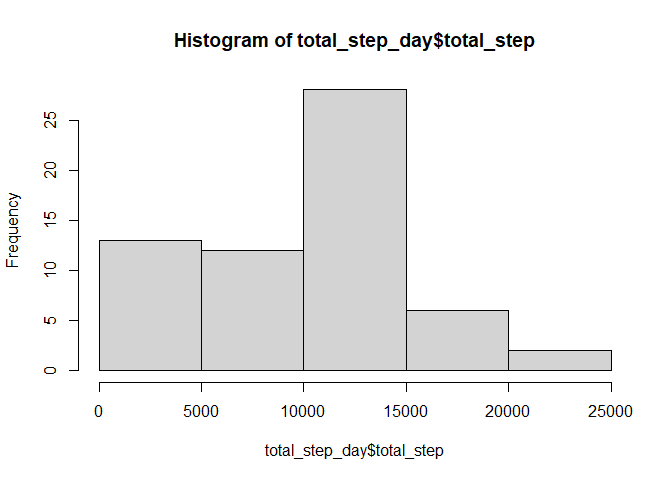
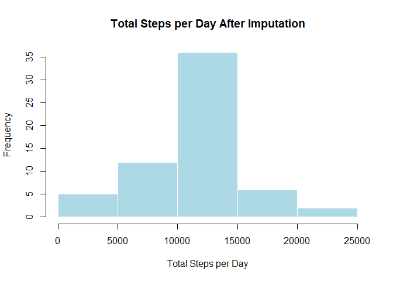
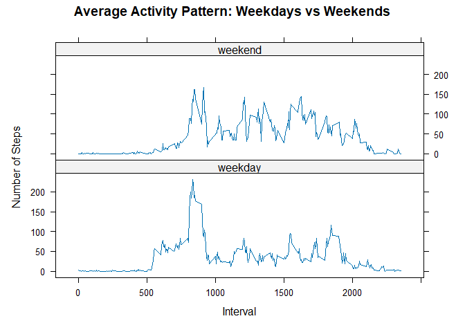

## Loading and preprocessing the data


## What is mean total number of steps taken per day?


``` r
total_step_day<- activities %>%
        group_by(date) %>% 
        summarise(total_step= sum(steps, na.rm= T))

total_step_day
```

```
## # A tibble: 61 × 2
##    date       total_step
##    <chr>           <int>
##  1 2012-10-01          0
##  2 2012-10-02        126
##  3 2012-10-03      11352
##  4 2012-10-04      12116
##  5 2012-10-05      13294
##  6 2012-10-06      15420
##  7 2012-10-07      11015
##  8 2012-10-08          0
##  9 2012-10-09      12811
## 10 2012-10-10       9900
## # ℹ 51 more rows
```


#### **histogram** of the total number of steps taken each day

``` r
hist(total_step_day$total_step)
```

<!-- -->

#### **mean** and **median** total number of steps taken per day

``` r
mean(total_step_day$total_step, na.rm = T)
```

```
## [1] 9354.23
```

``` r
median(total_step_day$total_step, na.rm = T)
```

```
## [1] 10395
```

## What is the average daily activity pattern?


``` r
activity_pattern <- activities %>%
    group_by(interval) %>%
    summarise(mean_steps = mean(steps, na.rm = TRUE))

activity_pattern
```

```
## # A tibble: 288 × 2
##    interval mean_steps
##       <int>      <dbl>
##  1        0     1.72  
##  2        5     0.340 
##  3       10     0.132 
##  4       15     0.151 
##  5       20     0.0755
##  6       25     2.09  
##  7       30     0.528 
##  8       35     0.868 
##  9       40     0     
## 10       45     1.47  
## # ℹ 278 more rows
```

#### **Time series plot** with ggplot2 

``` r
p<- ggplot(activity_pattern, aes(interval, mean_steps))+
        geom_line()+
        labs(title="Average Daily Activity Pattern",
              x= "5-Minute Interval",
              y= "Average Number of Steps")
     

library(plotly)
ggplotly(p) %>% 
        layout(
        title = "Average Daily Activity Pattern",
        xaxis = list(title = "5-Minute Interval"),
        yaxis = list(title = "Average Number of Steps")
    )
```

```{=html}
<div class="plotly html-widget html-fill-item" id="htmlwidget-c18dd0cbadf1d162ddc8" style="width:672px;height:480px;"></div>
<script type="application/json" data-for="htmlwidget-c18dd0cbadf1d162ddc8">{"x":{"data":[{"x":[0,5,10,15,20,25,30,35,40,45,50,55,100,105,110,115,120,125,130,135,140,145,150,155,200,205,210,215,220,225,230,235,240,245,250,255,300,305,310,315,320,325,330,335,340,345,350,355,400,405,410,415,420,425,430,435,440,445,450,455,500,505,510,515,520,525,530,535,540,545,550,555,600,605,610,615,620,625,630,635,640,645,650,655,700,705,710,715,720,725,730,735,740,745,750,755,800,805,810,815,820,825,830,835,840,845,850,855,900,905,910,915,920,925,930,935,940,945,950,955,1000,1005,1010,1015,1020,1025,1030,1035,1040,1045,1050,1055,1100,1105,1110,1115,1120,1125,1130,1135,1140,1145,1150,1155,1200,1205,1210,1215,1220,1225,1230,1235,1240,1245,1250,1255,1300,1305,1310,1315,1320,1325,1330,1335,1340,1345,1350,1355,1400,1405,1410,1415,1420,1425,1430,1435,1440,1445,1450,1455,1500,1505,1510,1515,1520,1525,1530,1535,1540,1545,1550,1555,1600,1605,1610,1615,1620,1625,1630,1635,1640,1645,1650,1655,1700,1705,1710,1715,1720,1725,1730,1735,1740,1745,1750,1755,1800,1805,1810,1815,1820,1825,1830,1835,1840,1845,1850,1855,1900,1905,1910,1915,1920,1925,1930,1935,1940,1945,1950,1955,2000,2005,2010,2015,2020,2025,2030,2035,2040,2045,2050,2055,2100,2105,2110,2115,2120,2125,2130,2135,2140,2145,2150,2155,2200,2205,2210,2215,2220,2225,2230,2235,2240,2245,2250,2255,2300,2305,2310,2315,2320,2325,2330,2335,2340,2345,2350,2355],"y":[1.7169811320754718,0.33962264150943394,0.13207547169811321,0.15094339622641509,0.075471698113207544,2.0943396226415096,0.52830188679245282,0.86792452830188682,0,1.4716981132075471,0.30188679245283018,0.13207547169811321,0.32075471698113206,0.67924528301886788,0.15094339622641509,0.33962264150943394,0,1.1132075471698113,1.8301886792452831,0.16981132075471697,0.16981132075471697,0.37735849056603776,0.26415094339622641,0,0,0,1.1320754716981132,0,0,0.13207547169811321,0,0.22641509433962265,0,0,1.5471698113207548,0.94339622641509435,0,0,0,0,0.20754716981132076,0.62264150943396224,1.6226415094339623,0.58490566037735847,0.49056603773584906,0.075471698113207544,0,0,1.1886792452830188,0.94339622641509435,2.5660377358490565,0,0.33962264150943394,0.35849056603773582,4.1132075471698117,0.660377358490566,3.4905660377358489,0.83018867924528306,3.1132075471698113,1.1132075471698113,0,1.5660377358490567,3,2.2452830188679247,3.3207547169811322,2.9622641509433962,2.0943396226415096,6.0566037735849054,16.018867924528301,18.339622641509433,39.452830188679243,44.490566037735846,31.490566037735849,49.264150943396224,53.773584905660378,63.452830188679243,49.962264150943398,47.075471698113205,52.150943396226417,39.339622641509436,44.018867924528301,44.169811320754718,37.358490566037737,49.037735849056602,43.811320754716981,44.377358490566039,50.509433962264154,54.509433962264154,49.924528301886795,50.981132075471699,55.679245283018865,44.320754716981135,52.264150943396224,69.547169811320757,57.849056603773583,56.150943396226417,73.377358490566039,68.20754716981132,129.43396226415095,157.52830188679246,171.15094339622641,155.39622641509433,177.30188679245282,206.16981132075472,195.9245283018868,179.56603773584905,183.39622641509433,167.01886792452831,143.45283018867926,124.0377358490566,109.11320754716981,108.11320754716981,103.71698113207547,95.962264150943398,66.20754716981132,45.226415094339622,24.79245283018868,38.754716981132077,34.981132075471699,21.056603773584907,40.566037735849058,26.981132075471699,42.415094339622641,52.660377358490564,38.924528301886795,50.79245283018868,44.283018867924525,37.415094339622641,34.698113207547166,28.339622641509433,25.09433962264151,31.943396226415093,31.358490566037737,29.679245283018869,21.320754716981131,25.547169811320753,28.377358490566039,26.471698113207548,33.433962264150942,49.981132075471699,42.037735849056602,44.60377358490566,46.037735849056602,59.188679245283019,63.867924528301884,87.698113207547166,94.84905660377359,92.773584905660371,63.39622641509434,50.169811320754718,54.471698113207545,32.415094339622641,26.528301886792452,37.735849056603776,45.056603773584904,67.283018867924525,42.339622641509436,39.886792452830186,43.264150943396224,40.981132075471699,46.245283018867923,56.433962264150942,42.754716981132077,25.132075471698112,39.962264150943398,53.547169811320757,47.320754716981135,60.811320754716981,55.754716981132077,51.962264150943398,43.584905660377359,48.698113207547166,35.471698113207545,37.547169811320757,41.849056603773583,27.509433962264151,17.113207547169811,26.075471698113208,43.622641509433961,43.773584905660378,30.018867924528301,36.075471698113205,35.490566037735846,38.849056603773583,45.962264150943398,47.754716981132077,48.132075471698116,65.320754716981128,82.905660377358487,98.660377358490564,102.11320754716981,83.962264150943398,62.132075471698116,64.132075471698116,74.547169811320757,63.169811320754718,56.905660377358494,59.773584905660378,43.867924528301884,38.566037735849058,44.660377358490564,45.452830188679243,46.20754716981132,43.679245283018865,46.622641509433961,56.301886792452834,50.716981132075475,61.226415094339622,72.716981132075475,78.943396226415089,68.943396226415089,59.660377358490564,75.094339622641513,56.509433962264154,34.773584905660378,37.452830188679243,40.679245283018865,58.018867924528301,74.698113207547166,85.320754716981128,59.264150943396224,67.773584905660371,77.698113207547166,74.245283018867923,85.339622641509436,99.452830188679243,86.584905660377359,85.603773584905667,84.867924528301884,77.830188679245282,58.037735849056602,53.358490566037737,36.320754716981135,20.716981132075471,27.39622641509434,40.018867924528301,30.20754716981132,25.547169811320753,45.660377358490564,33.528301886792455,19.622641509433961,19.018867924528301,19.339622641509433,33.339622641509436,26.811320754716981,21.169811320754718,27.30188679245283,21.339622641509433,19.547169811320753,21.320754716981131,32.301886792452834,20.150943396226417,15.943396226415095,17.226415094339622,23.452830188679247,19.245283018867923,12.452830188679245,8.0188679245283012,14.660377358490566,16.30188679245283,8.6792452830188687,7.7924528301886795,8.1320754716981138,2.6226415094339623,1.4528301886792452,3.6792452830188678,4.8113207547169807,8.5094339622641506,7.0754716981132075,8.6981132075471699,9.7547169811320753,2.2075471698113209,0.32075471698113206,0.11320754716981132,1.6037735849056605,4.6037735849056602,3.3018867924528301,2.8490566037735849,0,0.83018867924528306,0.96226415094339623,1.5849056603773586,2.6037735849056602,4.6981132075471699,3.3018867924528301,0.64150943396226412,0.22641509433962265,1.0754716981132075],"text":["interval:    0<br />mean_steps:   1.7169811","interval:    5<br />mean_steps:   0.3396226","interval:   10<br />mean_steps:   0.1320755","interval:   15<br />mean_steps:   0.1509434","interval:   20<br />mean_steps:   0.0754717","interval:   25<br />mean_steps:   2.0943396","interval:   30<br />mean_steps:   0.5283019","interval:   35<br />mean_steps:   0.8679245","interval:   40<br />mean_steps:   0.0000000","interval:   45<br />mean_steps:   1.4716981","interval:   50<br />mean_steps:   0.3018868","interval:   55<br />mean_steps:   0.1320755","interval:  100<br />mean_steps:   0.3207547","interval:  105<br />mean_steps:   0.6792453","interval:  110<br />mean_steps:   0.1509434","interval:  115<br />mean_steps:   0.3396226","interval:  120<br />mean_steps:   0.0000000","interval:  125<br />mean_steps:   1.1132075","interval:  130<br />mean_steps:   1.8301887","interval:  135<br />mean_steps:   0.1698113","interval:  140<br />mean_steps:   0.1698113","interval:  145<br />mean_steps:   0.3773585","interval:  150<br />mean_steps:   0.2641509","interval:  155<br />mean_steps:   0.0000000","interval:  200<br />mean_steps:   0.0000000","interval:  205<br />mean_steps:   0.0000000","interval:  210<br />mean_steps:   1.1320755","interval:  215<br />mean_steps:   0.0000000","interval:  220<br />mean_steps:   0.0000000","interval:  225<br />mean_steps:   0.1320755","interval:  230<br />mean_steps:   0.0000000","interval:  235<br />mean_steps:   0.2264151","interval:  240<br />mean_steps:   0.0000000","interval:  245<br />mean_steps:   0.0000000","interval:  250<br />mean_steps:   1.5471698","interval:  255<br />mean_steps:   0.9433962","interval:  300<br />mean_steps:   0.0000000","interval:  305<br />mean_steps:   0.0000000","interval:  310<br />mean_steps:   0.0000000","interval:  315<br />mean_steps:   0.0000000","interval:  320<br />mean_steps:   0.2075472","interval:  325<br />mean_steps:   0.6226415","interval:  330<br />mean_steps:   1.6226415","interval:  335<br />mean_steps:   0.5849057","interval:  340<br />mean_steps:   0.4905660","interval:  345<br />mean_steps:   0.0754717","interval:  350<br />mean_steps:   0.0000000","interval:  355<br />mean_steps:   0.0000000","interval:  400<br />mean_steps:   1.1886792","interval:  405<br />mean_steps:   0.9433962","interval:  410<br />mean_steps:   2.5660377","interval:  415<br />mean_steps:   0.0000000","interval:  420<br />mean_steps:   0.3396226","interval:  425<br />mean_steps:   0.3584906","interval:  430<br />mean_steps:   4.1132075","interval:  435<br />mean_steps:   0.6603774","interval:  440<br />mean_steps:   3.4905660","interval:  445<br />mean_steps:   0.8301887","interval:  450<br />mean_steps:   3.1132075","interval:  455<br />mean_steps:   1.1132075","interval:  500<br />mean_steps:   0.0000000","interval:  505<br />mean_steps:   1.5660377","interval:  510<br />mean_steps:   3.0000000","interval:  515<br />mean_steps:   2.2452830","interval:  520<br />mean_steps:   3.3207547","interval:  525<br />mean_steps:   2.9622642","interval:  530<br />mean_steps:   2.0943396","interval:  535<br />mean_steps:   6.0566038","interval:  540<br />mean_steps:  16.0188679","interval:  545<br />mean_steps:  18.3396226","interval:  550<br />mean_steps:  39.4528302","interval:  555<br />mean_steps:  44.4905660","interval:  600<br />mean_steps:  31.4905660","interval:  605<br />mean_steps:  49.2641509","interval:  610<br />mean_steps:  53.7735849","interval:  615<br />mean_steps:  63.4528302","interval:  620<br />mean_steps:  49.9622642","interval:  625<br />mean_steps:  47.0754717","interval:  630<br />mean_steps:  52.1509434","interval:  635<br />mean_steps:  39.3396226","interval:  640<br />mean_steps:  44.0188679","interval:  645<br />mean_steps:  44.1698113","interval:  650<br />mean_steps:  37.3584906","interval:  655<br />mean_steps:  49.0377358","interval:  700<br />mean_steps:  43.8113208","interval:  705<br />mean_steps:  44.3773585","interval:  710<br />mean_steps:  50.5094340","interval:  715<br />mean_steps:  54.5094340","interval:  720<br />mean_steps:  49.9245283","interval:  725<br />mean_steps:  50.9811321","interval:  730<br />mean_steps:  55.6792453","interval:  735<br />mean_steps:  44.3207547","interval:  740<br />mean_steps:  52.2641509","interval:  745<br />mean_steps:  69.5471698","interval:  750<br />mean_steps:  57.8490566","interval:  755<br />mean_steps:  56.1509434","interval:  800<br />mean_steps:  73.3773585","interval:  805<br />mean_steps:  68.2075472","interval:  810<br />mean_steps: 129.4339623","interval:  815<br />mean_steps: 157.5283019","interval:  820<br />mean_steps: 171.1509434","interval:  825<br />mean_steps: 155.3962264","interval:  830<br />mean_steps: 177.3018868","interval:  835<br />mean_steps: 206.1698113","interval:  840<br />mean_steps: 195.9245283","interval:  845<br />mean_steps: 179.5660377","interval:  850<br />mean_steps: 183.3962264","interval:  855<br />mean_steps: 167.0188679","interval:  900<br />mean_steps: 143.4528302","interval:  905<br />mean_steps: 124.0377358","interval:  910<br />mean_steps: 109.1132075","interval:  915<br />mean_steps: 108.1132075","interval:  920<br />mean_steps: 103.7169811","interval:  925<br />mean_steps:  95.9622642","interval:  930<br />mean_steps:  66.2075472","interval:  935<br />mean_steps:  45.2264151","interval:  940<br />mean_steps:  24.7924528","interval:  945<br />mean_steps:  38.7547170","interval:  950<br />mean_steps:  34.9811321","interval:  955<br />mean_steps:  21.0566038","interval: 1000<br />mean_steps:  40.5660377","interval: 1005<br />mean_steps:  26.9811321","interval: 1010<br />mean_steps:  42.4150943","interval: 1015<br />mean_steps:  52.6603774","interval: 1020<br />mean_steps:  38.9245283","interval: 1025<br />mean_steps:  50.7924528","interval: 1030<br />mean_steps:  44.2830189","interval: 1035<br />mean_steps:  37.4150943","interval: 1040<br />mean_steps:  34.6981132","interval: 1045<br />mean_steps:  28.3396226","interval: 1050<br />mean_steps:  25.0943396","interval: 1055<br />mean_steps:  31.9433962","interval: 1100<br />mean_steps:  31.3584906","interval: 1105<br />mean_steps:  29.6792453","interval: 1110<br />mean_steps:  21.3207547","interval: 1115<br />mean_steps:  25.5471698","interval: 1120<br />mean_steps:  28.3773585","interval: 1125<br />mean_steps:  26.4716981","interval: 1130<br />mean_steps:  33.4339623","interval: 1135<br />mean_steps:  49.9811321","interval: 1140<br />mean_steps:  42.0377358","interval: 1145<br />mean_steps:  44.6037736","interval: 1150<br />mean_steps:  46.0377358","interval: 1155<br />mean_steps:  59.1886792","interval: 1200<br />mean_steps:  63.8679245","interval: 1205<br />mean_steps:  87.6981132","interval: 1210<br />mean_steps:  94.8490566","interval: 1215<br />mean_steps:  92.7735849","interval: 1220<br />mean_steps:  63.3962264","interval: 1225<br />mean_steps:  50.1698113","interval: 1230<br />mean_steps:  54.4716981","interval: 1235<br />mean_steps:  32.4150943","interval: 1240<br />mean_steps:  26.5283019","interval: 1245<br />mean_steps:  37.7358491","interval: 1250<br />mean_steps:  45.0566038","interval: 1255<br />mean_steps:  67.2830189","interval: 1300<br />mean_steps:  42.3396226","interval: 1305<br />mean_steps:  39.8867925","interval: 1310<br />mean_steps:  43.2641509","interval: 1315<br />mean_steps:  40.9811321","interval: 1320<br />mean_steps:  46.2452830","interval: 1325<br />mean_steps:  56.4339623","interval: 1330<br />mean_steps:  42.7547170","interval: 1335<br />mean_steps:  25.1320755","interval: 1340<br />mean_steps:  39.9622642","interval: 1345<br />mean_steps:  53.5471698","interval: 1350<br />mean_steps:  47.3207547","interval: 1355<br />mean_steps:  60.8113208","interval: 1400<br />mean_steps:  55.7547170","interval: 1405<br />mean_steps:  51.9622642","interval: 1410<br />mean_steps:  43.5849057","interval: 1415<br />mean_steps:  48.6981132","interval: 1420<br />mean_steps:  35.4716981","interval: 1425<br />mean_steps:  37.5471698","interval: 1430<br />mean_steps:  41.8490566","interval: 1435<br />mean_steps:  27.5094340","interval: 1440<br />mean_steps:  17.1132075","interval: 1445<br />mean_steps:  26.0754717","interval: 1450<br />mean_steps:  43.6226415","interval: 1455<br />mean_steps:  43.7735849","interval: 1500<br />mean_steps:  30.0188679","interval: 1505<br />mean_steps:  36.0754717","interval: 1510<br />mean_steps:  35.4905660","interval: 1515<br />mean_steps:  38.8490566","interval: 1520<br />mean_steps:  45.9622642","interval: 1525<br />mean_steps:  47.7547170","interval: 1530<br />mean_steps:  48.1320755","interval: 1535<br />mean_steps:  65.3207547","interval: 1540<br />mean_steps:  82.9056604","interval: 1545<br />mean_steps:  98.6603774","interval: 1550<br />mean_steps: 102.1132075","interval: 1555<br />mean_steps:  83.9622642","interval: 1600<br />mean_steps:  62.1320755","interval: 1605<br />mean_steps:  64.1320755","interval: 1610<br />mean_steps:  74.5471698","interval: 1615<br />mean_steps:  63.1698113","interval: 1620<br />mean_steps:  56.9056604","interval: 1625<br />mean_steps:  59.7735849","interval: 1630<br />mean_steps:  43.8679245","interval: 1635<br />mean_steps:  38.5660377","interval: 1640<br />mean_steps:  44.6603774","interval: 1645<br />mean_steps:  45.4528302","interval: 1650<br />mean_steps:  46.2075472","interval: 1655<br />mean_steps:  43.6792453","interval: 1700<br />mean_steps:  46.6226415","interval: 1705<br />mean_steps:  56.3018868","interval: 1710<br />mean_steps:  50.7169811","interval: 1715<br />mean_steps:  61.2264151","interval: 1720<br />mean_steps:  72.7169811","interval: 1725<br />mean_steps:  78.9433962","interval: 1730<br />mean_steps:  68.9433962","interval: 1735<br />mean_steps:  59.6603774","interval: 1740<br />mean_steps:  75.0943396","interval: 1745<br />mean_steps:  56.5094340","interval: 1750<br />mean_steps:  34.7735849","interval: 1755<br />mean_steps:  37.4528302","interval: 1800<br />mean_steps:  40.6792453","interval: 1805<br />mean_steps:  58.0188679","interval: 1810<br />mean_steps:  74.6981132","interval: 1815<br />mean_steps:  85.3207547","interval: 1820<br />mean_steps:  59.2641509","interval: 1825<br />mean_steps:  67.7735849","interval: 1830<br />mean_steps:  77.6981132","interval: 1835<br />mean_steps:  74.2452830","interval: 1840<br />mean_steps:  85.3396226","interval: 1845<br />mean_steps:  99.4528302","interval: 1850<br />mean_steps:  86.5849057","interval: 1855<br />mean_steps:  85.6037736","interval: 1900<br />mean_steps:  84.8679245","interval: 1905<br />mean_steps:  77.8301887","interval: 1910<br />mean_steps:  58.0377358","interval: 1915<br />mean_steps:  53.3584906","interval: 1920<br />mean_steps:  36.3207547","interval: 1925<br />mean_steps:  20.7169811","interval: 1930<br />mean_steps:  27.3962264","interval: 1935<br />mean_steps:  40.0188679","interval: 1940<br />mean_steps:  30.2075472","interval: 1945<br />mean_steps:  25.5471698","interval: 1950<br />mean_steps:  45.6603774","interval: 1955<br />mean_steps:  33.5283019","interval: 2000<br />mean_steps:  19.6226415","interval: 2005<br />mean_steps:  19.0188679","interval: 2010<br />mean_steps:  19.3396226","interval: 2015<br />mean_steps:  33.3396226","interval: 2020<br />mean_steps:  26.8113208","interval: 2025<br />mean_steps:  21.1698113","interval: 2030<br />mean_steps:  27.3018868","interval: 2035<br />mean_steps:  21.3396226","interval: 2040<br />mean_steps:  19.5471698","interval: 2045<br />mean_steps:  21.3207547","interval: 2050<br />mean_steps:  32.3018868","interval: 2055<br />mean_steps:  20.1509434","interval: 2100<br />mean_steps:  15.9433962","interval: 2105<br />mean_steps:  17.2264151","interval: 2110<br />mean_steps:  23.4528302","interval: 2115<br />mean_steps:  19.2452830","interval: 2120<br />mean_steps:  12.4528302","interval: 2125<br />mean_steps:   8.0188679","interval: 2130<br />mean_steps:  14.6603774","interval: 2135<br />mean_steps:  16.3018868","interval: 2140<br />mean_steps:   8.6792453","interval: 2145<br />mean_steps:   7.7924528","interval: 2150<br />mean_steps:   8.1320755","interval: 2155<br />mean_steps:   2.6226415","interval: 2200<br />mean_steps:   1.4528302","interval: 2205<br />mean_steps:   3.6792453","interval: 2210<br />mean_steps:   4.8113208","interval: 2215<br />mean_steps:   8.5094340","interval: 2220<br />mean_steps:   7.0754717","interval: 2225<br />mean_steps:   8.6981132","interval: 2230<br />mean_steps:   9.7547170","interval: 2235<br />mean_steps:   2.2075472","interval: 2240<br />mean_steps:   0.3207547","interval: 2245<br />mean_steps:   0.1132075","interval: 2250<br />mean_steps:   1.6037736","interval: 2255<br />mean_steps:   4.6037736","interval: 2300<br />mean_steps:   3.3018868","interval: 2305<br />mean_steps:   2.8490566","interval: 2310<br />mean_steps:   0.0000000","interval: 2315<br />mean_steps:   0.8301887","interval: 2320<br />mean_steps:   0.9622642","interval: 2325<br />mean_steps:   1.5849057","interval: 2330<br />mean_steps:   2.6037736","interval: 2335<br />mean_steps:   4.6981132","interval: 2340<br />mean_steps:   3.3018868","interval: 2345<br />mean_steps:   0.6415094","interval: 2350<br />mean_steps:   0.2264151","interval: 2355<br />mean_steps:   1.0754717"],"type":"scatter","mode":"lines","line":{"width":1.8897637795275593,"color":"rgba(0,0,0,1)","dash":"solid"},"hoveron":"points","showlegend":false,"xaxis":"x","yaxis":"y","hoverinfo":"text","frame":null}],"layout":{"margin":{"t":40.840182648401829,"r":7.3059360730593621,"b":37.260273972602747,"l":43.105022831050235},"plot_bgcolor":"rgba(235,235,235,1)","paper_bgcolor":"rgba(255,255,255,1)","font":{"color":"rgba(0,0,0,1)","family":"","size":14.611872146118724},"title":"Average Daily Activity Pattern","xaxis":{"domain":[0,1],"automargin":true,"type":"linear","autorange":false,"range":[-117.75,2472.75],"tickmode":"array","ticktext":["0","500","1000","1500","2000"],"tickvals":[0,500,1000,1500,2000],"categoryorder":"array","categoryarray":["0","500","1000","1500","2000"],"nticks":null,"ticks":"outside","tickcolor":"rgba(51,51,51,1)","ticklen":3.6529680365296811,"tickwidth":0.66417600664176002,"showticklabels":true,"tickfont":{"color":"rgba(77,77,77,1)","family":"","size":11.68949771689498},"tickangle":-0,"showline":false,"linecolor":null,"linewidth":0,"showgrid":true,"gridcolor":"rgba(255,255,255,1)","gridwidth":0.66417600664176002,"zeroline":false,"anchor":"y","title":"5-Minute Interval","hoverformat":".2f"},"yaxis":{"domain":[0,1],"automargin":true,"type":"linear","autorange":false,"range":[-10.308490566037737,216.47830188679245],"tickmode":"array","ticktext":["0","50","100","150","200"],"tickvals":[0,50,100,150,200],"categoryorder":"array","categoryarray":["0","50","100","150","200"],"nticks":null,"ticks":"outside","tickcolor":"rgba(51,51,51,1)","ticklen":3.6529680365296811,"tickwidth":0.66417600664176002,"showticklabels":true,"tickfont":{"color":"rgba(77,77,77,1)","family":"","size":11.68949771689498},"tickangle":-0,"showline":false,"linecolor":null,"linewidth":0,"showgrid":true,"gridcolor":"rgba(255,255,255,1)","gridwidth":0.66417600664176002,"zeroline":false,"anchor":"x","title":"Average Number of Steps","hoverformat":".2f"},"shapes":[],"showlegend":false,"legend":{"bgcolor":"rgba(255,255,255,1)","bordercolor":"transparent","borderwidth":1.8897637795275593,"font":{"color":"rgba(0,0,0,1)","family":"","size":11.68949771689498}},"hovermode":"closest","barmode":"relative"},"config":{"doubleClick":"reset","modeBarButtonsToAdd":["hoverclosest","hovercompare"],"showSendToCloud":false},"source":"A","attrs":{"16f470c221f5":{"x":{},"y":{},"type":"scatter"}},"cur_data":"16f470c221f5","visdat":{"16f470c221f5":["function (y) ","x"]},"highlight":{"on":"plotly_click","persistent":false,"dynamic":false,"selectize":false,"opacityDim":0.20000000000000001,"selected":{"opacity":1},"debounce":0},"shinyEvents":["plotly_hover","plotly_click","plotly_selected","plotly_relayout","plotly_brushed","plotly_brushing","plotly_clickannotation","plotly_doubleclick","plotly_deselect","plotly_afterplot","plotly_sunburstclick"],"base_url":"https://plot.ly"},"evals":[],"jsHooks":[]}</script>
```


#### The interval with maximum activity

``` r
activity_pattern %>%
    filter(mean_steps == max(mean_steps))
```

```
## # A tibble: 1 × 2
##   interval mean_steps
##      <int>      <dbl>
## 1      835       206.
```


## Imputing missing values

#### Number of missing values in rows

``` r
sum(is.na(activities$steps))
```

```
## [1] 2304
```

#### confirming that the other variables contain no missing observations

``` r
colSums(is.na(activities))
```

```
##    steps     date interval 
##     2304        0        0
```

#### Imputation strategy

#### Devising a strategy for filling in all of the missing values in the dataset.


``` r
# Mean for each 5-minute interval
imputeNA_with_mean<- activities %>% 
        group_by(interval) %>% 
        mutate(steps= if_else(is.na(steps),
                              mean(steps,na.rm= TRUE),
                              steps))
imputeNA_with_mean
```

```
## # A tibble: 17,568 × 3
## # Groups:   interval [288]
##     steps date       interval
##     <dbl> <chr>         <int>
##  1 1.72   2012-10-01        0
##  2 0.340  2012-10-01        5
##  3 0.132  2012-10-01       10
##  4 0.151  2012-10-01       15
##  5 0.0755 2012-10-01       20
##  6 2.09   2012-10-01       25
##  7 0.528  2012-10-01       30
##  8 0.868  2012-10-01       35
##  9 0      2012-10-01       40
## 10 1.47   2012-10-01       45
## # ℹ 17,558 more rows
```

#### Creating new data set with missing values

``` r
# Computing the interval mean
avg_interval <- activities %>%
    group_by(interval) %>%
    summarise(mean_steps = mean(steps, na.rm = TRUE))


# Creating a new data set:
activities_imputed <- activities %>%
    left_join(avg_interval, by = "interval") %>%
    mutate(steps = ifelse(is.na(steps),
                          mean_steps,
                          steps)) %>%
    select(steps, date, interval)

# Checking if there is any missing values 
sum(is.na(activities_imputed$steps))
```

```
## [1] 0
```

#### Daily steps after imputing missing values

``` r
daily_steps_imputed <- activities_imputed %>%
    group_by(date) %>%
    summarise(total_steps = sum(steps))
```


#### Histogram

``` r
hist(daily_steps_imputed$total_steps,
     main = "Total Steps per Day After Imputation",
     xlab = "Total Steps per Day",
     col = "lightblue",
     border = "white")
```

<!-- -->

#### Calculating mean and median

``` r
mean(daily_steps_imputed$total_steps)
```

```
## [1] 10766.19
```

``` r
median(daily_steps_imputed$total_steps)
```

```
## [1] 10766.19
```

## Are there differences in activity patterns between weekdays and weekends?

#### Creating weekday/weekend variable

``` r
activities_imputed$date<- as.Date(activities_imputed$date)

activities_imputed <- activities_imputed %>%
    mutate(day = weekdays(date),
           day_type = ifelse(day %in% c("Saturday", "Sunday"),
                             "weekend",
                             "weekday"),
           day_type = factor(day_type,
                             levels = c("weekday", "weekend")))
activities_imputed

# Checking 
table(activities_imputed$day_type)
```

#### calculating the mean number of steps for each interval and day type

``` r
activity_pattern <- activities_imputed %>%
    group_by(day_type, interval) %>%
    summarise(mean_steps = mean(steps),
              .groups = "drop")
activity_pattern
```

```
## # A tibble: 576 × 3
##    day_type interval mean_steps
##    <fct>       <int>      <dbl>
##  1 weekday         0     2.25  
##  2 weekday         5     0.445 
##  3 weekday        10     0.173 
##  4 weekday        15     0.198 
##  5 weekday        20     0.0990
##  6 weekday        25     1.59  
##  7 weekday        30     0.693 
##  8 weekday        35     1.14  
##  9 weekday        40     0     
## 10 weekday        45     1.80  
## # ℹ 566 more rows
```


#### Plotting with lattice

``` r
library(lattice)

xyplot(mean_steps ~ interval | day_type,
       data = activity_pattern,
       type = "l",
       layout = c(1, 2),
       xlab = "Interval",
       ylab = "Number of Steps",
       main = "Average Activity Pattern: Weekdays vs Weekends")
```

<!-- -->


